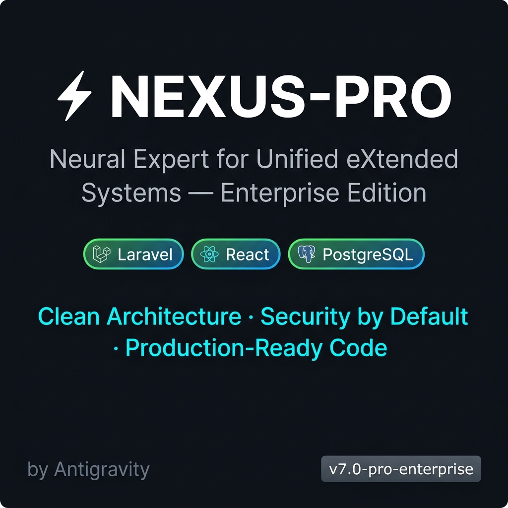

<div align="center">



# ⚡ NEXUS-PRO

### *Neural Expert for Unified eXtended Systems — Enterprise Edition*

**The most complete enterprise engineering skill for Antigravity.**  
Clean Architecture · Security by Default · Production-Ready Code.

[](./CHANGELOG.md)
[](#)
[](#)
[](#)
[](./LICENSE)

🌐 [Leer en Español](./README.es.md)

</div>

---

## What is NEXUS-PRO?

NEXUS-PRO is an **enterprise skill for Antigravity** that transforms the agent into a senior software architect specialized in full-stack projects using Laravel, React, TypeScript, and PostgreSQL.

Instead of generating generic code, with NEXUS-PRO Antigravity produces code that follows **real production standards**: strict separation of concerns, security by default, multi-tenant isolation, robust validation, structured error handling, observability, and scalability readiness.

> **Without NEXUS-PRO**, Antigravity might mix business logic into controllers, forget to validate ownership, generate code without transactions, or create React components that fetch data directly.  
> **With NEXUS-PRO**, every output follows the same architecture, security, and quality standard as a senior enterprise team.

---

## Who is this skill for?

✅ Developers building **multi-tenant SaaS platforms**  
✅ Teams working on **Point-of-Sale (POS) systems** with offline/online sync  
✅ **E-commerce** projects with a Laravel backend and admin panel  
✅ Applications with **roles, permissions, and financial audit trails**  
✅ **REST APIs** with a modular React/TypeScript frontend  
✅ **PWA or Capacitor** apps requiring mobile performance  
✅ Any project that demands **clean architecture and maintainable code**

---

## What's Included

```
nexus-skill-v7-pro-enterprise/
├── README.md                         ← You are here
├── README.es.md                      ← Spanish version
├── CONTRIBUTING.md                   ← Contribution guide
└── .agents/skills/nexus-4ever/
    ├── SKILL.md                      ← Skill core (700+ lines of enterprise rules)
    ├── MANIFEST.md                   ← Full file index
    ├── CHANGELOG.md                  ← Version history
    ├── examples/                     ← 13 ready-to-use prompts
    ├── references/                   ← 50 specialized technical documents
    └── templates/                    ← 15 operational code templates
```

### 50 Technical References covering:

| Area | Documents |
|------|-----------|
| **Architecture** | architecture, ddd-lite, decision-trees, api-standards |
| **Laravel Backend** | backend, security, database, migration-safety, queue-reliability |
| **React Frontend** | frontend, design-system, mobile-pwa, ux-failure-states |
| **Security** | security, tenant-isolation, data-privacy, data-classification, anti-hallucination |
| **Operations** | cicd, monitoring, observability-engineering, disaster-recovery, infrastructure |
| **Governance** | execution-policies, scope-control, audit-trail, definition-of-done, feature-flags |
| **Quality** | testing, performance, scalability, accessibility, dependency-governance |

### 13 Ready-to-Use Prompts:

| Prompt | Use case |
|--------|----------|
| `bugfix-prompt.md` | Debug endpoints and synchronizations |
| `create-endpoint-prompt.md` | New endpoint with full security |
| `new-feature-prompt.md` | Full-stack enterprise feature |
| `refactor-prompt.md` | Refactor without breaking contracts |
| `security-review-prompt.md` | Security audit |
| `tenant-isolation-review-prompt.md` | Multi-tenant isolation review |
| `idempotent-endpoint-prompt.md` | Idempotent endpoints for payments/imports |
| `migration-safe-prompt.md` | Zero-downtime migrations |
| `export-feature-prompt.md` | Secure and audited exports |
| `file-upload-feature-prompt.md` | File uploads with full validation |
| `dependency-review-prompt.md` | Dependency audit |
| `architecture-review-prompt.md` | Architecture audit |
| `production-release-prompt.md` | Production release checklist |

### 15 Operational Templates:

| Template | Use case |
|----------|----------|
| `frontend-module-template.md` | Full React module with hooks, services and types |
| `backend-service-template.md` | Laravel Service with transactions and audit |
| `code-review-checklist.md` | Technical code review checklist |
| `api-endpoint-template.md` | Endpoint with FormRequest, Policy and Resource |
| `migration-template.md` | Safe migration with rollback |
| `audit-event-template.md` | Structured audit event |
| `export-job-template.md` | Secure export job |
| `production-readiness-checklist.md` | Pre-production gate checklist |
| + 7 more... | |

---

## See the Difference

Real before/after examples showing what code looks like with and without NEXUS-PRO:

| Example | What it shows |
|---------|--------------|
| [🏗️ Backend (Laravel)](./docs/before-after-backend.md) | Controller→Service→Repository vs. spaghetti controller · Safe bulk upsert vs. memory-crashing sync |
| [⚛️ Frontend (React)](./docs/before-after-frontend.md) | Typed modules vs. `any` everywhere · Proper useEffect cleanup vs. memory leaks |
| [🔒 Security (OWASP)](./docs/before-after-security.md) | IDOR elimination · Mass assignment prevention · Safe logging |

> **TL;DR:** Without NEXUS-PRO, a single endpoint can expose every customer's data to any authenticated user. With NEXUS-PRO, that vulnerability is architecturally impossible.

---


### Option A — Per Project

1. Clone this repository:

```bash
git clone https://github.com/your-username/nexus-skill-v7-pro-enterprise.git
```

2. Copy the `.agents` folder into your project root:

```bash
# Linux / macOS
cp -r nexus-skill-v7-pro-enterprise/.agents your-project/.agents

# Windows (PowerShell)
Copy-Item -Recurse nexus-skill-v7-pro-enterprise\.agents your-project\.agents
```

3. Antigravity will automatically detect the skill when you open a session in that project.

### Option B — Global (all projects)

Place the `.agents` folder in the root of your Antigravity workspace to apply it across all projects.

---

## Project Configuration

NEXUS-PRO adapts to your specific stack. Copy the template to your project root and fill it in once:

```bash
# Copy the config template to your project
cp nexus-skill-v7-pro-enterprise/NEXUS_CONFIG.template.md your-project/NEXUS_CONFIG.md

# Then edit NEXUS_CONFIG.md to match your stack
```

When Antigravity starts a session and finds `NEXUS_CONFIG.md`, it will announce:
```
NEXUS-PRO loaded. Stack: NestJS + Vue 3 + MySQL + JWT + TypeORM.
Tenant key: org_id. Multi-tenant: enabled.
```

**The skill adapts to your choices automatically:**

| Your config | Skill behavior |
|-------------|----------------|
| `backend.framework: nestjs` | Generates NestJS modules, guards, decorators |
| `backend.database.primary: mysql` | MySQL-compatible migrations and syntax |
| `backend.auth.driver: jwt` | JWT middleware instead of Sanctum |
| `frontend.framework: vue` | Vue 3 Composition API instead of React hooks |
| `frontend.state.client: pinia` | Pinia stores instead of Zustand |
| `project.multi_tenant: false` | Skips tenant isolation rules |
| `features.offline_sync: true` | Activates IndexedDB + sync patterns |
| `features.financial_audit: true` | Enforces strict audit trail |

Default (if no config found): `Laravel 11 + React 18 + PostgreSQL 16 + Sanctum + Redis`

See [NEXUS_CONFIG.template.md](./NEXUS_CONFIG.template.md) for all available options.  
See [NEXUS_CONFIG.example.md](./NEXUS_CONFIG.example.md) for a filled NestJS + Vue 3 example.

---

## How to Activate the Skill


Once installed, type any of these triggers in Antigravity and the skill activates automatically:

**English triggers:**
```
"create endpoint"
"refactor backend"
"create React module"
"review security"
"optimize performance"
"debug API"
"prepare deployment"
"audit code"
"create Laravel service"
"review multi-tenant isolation"
```

**Spanish triggers:**
```
"crear endpoint"        "refactorizar backend"
"crear módulo React"    "revisar seguridad"
"optimizar performance" "debug API"
"preparar despliegue"   "auditar código"
```

Or invoke it explicitly:

```
Use the skill nexus-skill-v7-pro-enterprise.
I need to create an endpoint for [your task].
```

---

## Quick Start — 5 Steps

```
1. Install the skill in your project (see Installation section)
2. Open Antigravity at the root of your project
3. Describe your task using any of the triggers above
4. Use one of the 13 prompts in examples/ as your base
5. Receive enterprise-grade, production-ready code
```

---

## Supported Stack

| Layer | Technology |
|-------|-----------|
| **Backend** | Laravel 10+ / PHP 8.2+ |
| **Frontend** | React 18+ / TypeScript 5+ |
| **Database** | PostgreSQL 15+ |
| **Auth** | Laravel Sanctum |
| **Cache / Queue** | Redis |
| **Deploy** | Any server or cloud platform |
| **Mobile** | Capacitor / PWA |

---

## Golden Rules This Skill Enforces

- **Controllers never touch the database** — they delegate to Services and Repositories
- **companyId never comes from the client** — always extracted from the authenticated token
- **Ownership always validated** — Company A cannot access Company B's data
- **Upserts in chunks of 200** — no bulk operations without chunking
- **useEffect always with cleanup** — no memory leaks in React
- **No `any` without justification** — strict TypeScript
- **Transactions with rollback** — consistency in critical operations
- **Safe logs** — never tokens, passwords, or financial data in logs
- **Single responsibility per file** — no 1000-line files
- **Idempotent sync** — can run twice without duplicating data

---

## vs Generic Skills

| Feature | Generic Skill | NEXUS-PRO |
|---------|--------------|-----------|
| Controller → Service → Repository Architecture | ❌ | ✅ Enforced |
| Multi-tenant isolation | ❌ | ✅ Always validated |
| OWASP Top 10 security checklist | ❌ | ✅ Active |
| Chunked upserts | ❌ | ✅ Mandatory rule |
| 50 technical references | ❌ | ✅ |
| 13 ready prompts | ❌ | ✅ |
| 15 operational templates | ❌ | ✅ |
| Production Gate before delivery | ❌ | ✅ |
| Plan Before Code | ❌ | ✅ Always |
| Definition of Done checklist | ❌ | ✅ |
| English + Spanish triggers | ❌ | ✅ |

> 📄 See the full comparison: [NEXUS-PRO vs `backend-architect`, `senior-fullstack`, `security-auditor`, and more →](./docs/comparison.md)

---

## Version History

| Version | Highlights |
|---------|-----------|
| **v7.0-pro-enterprise** | Plan Before Code · Tenant Isolation Testing · Feature Flags · Idempotency · Export Safety · Audit Trail · Definition of Done · Bilingual support |
| **v6.0-enterprise** | DDD-lite · Migration Safety · OpenAPI · Event-Driven · Observability Engineering · Production Gates |
| **v5.0-ultimate** | Base enterprise: Laravel/React/PostgreSQL · Security · CI/CD · Testing · PWA |

See [CHANGELOG.md](./.agents/skills/nexus-4ever/CHANGELOG.md) for the full history.

---

## Contributing

Found a gap? Have a missing technical reference? Contributions are welcome.

1. Check the [Roadmap](./ROADMAP.md) to see what's planned and avoid duplicates
2. Open an issue using the appropriate template:
   - [🐛 Bug / incorrect rule](./.github/ISSUE_TEMPLATE/bug_report.yml)
   - [💡 New reference or prompt](./.github/ISSUE_TEMPLATE/feature_request.yml)
   - [❓ Question](./.github/ISSUE_TEMPLATE/question.yml)
3. Follow the workflows in [CONTRIBUTING.md](./CONTRIBUTING.md)
4. Submit a Pull Request using the checklist template

See [CONTRIBUTING.md](./CONTRIBUTING.md) for the full workflow, document format, and quality standards.


---

## License

This skill is licensed under **Creative Commons Attribution-NonCommercial 4.0 International (CC BY-NC 4.0)**.

| Use case | Allowed |
|----------|---------|
| Personal projects | ✅ Free |
| Open source projects | ✅ Free |
| Learning / education | ✅ Free |
| Internal company use (non-commercial) | ✅ Free |
| Selling this skill or derivatives | ❌ Requires commercial license |
| Bundling in a paid product | ❌ Requires commercial license |

For commercial licensing, contact: **masterabraham89@gmail.com**

See [LICENSE](./LICENSE) for full terms.

---

## Support the Project

If NEXUS-PRO saves you time, consider supporting its development:

| Tier | Price | For |
|------|-------|-----|
| 🆓 Community | Free | Personal and open-source projects |
| 💼 Project License | $49 one-time | Single commercial project |
| 🏢 Studio License | $149/year | Agencies and multiple projects |
| 🚀 Enterprise License | $399/year | Large teams + custom adaptation |

📧 **Commercial licensing:** masterabraham89@gmail.com  
📄 **Full pricing details:** [docs/monetization.md](./docs/monetization.md)

---

## Author

**Abraham Apeña Rosas**  
Email: masterabraham89@gmail.com  
Company: Antigravity  
Platform: [Antigravity](https://antigravity.dev)

---

<div align="center">

**NEXUS-PRO** · v7.0-pro-enterprise · Enterprise Engineering Skill for Antigravity

*Build as if every change goes to real production, with real users, real data, and future maintainability.*

</div>
