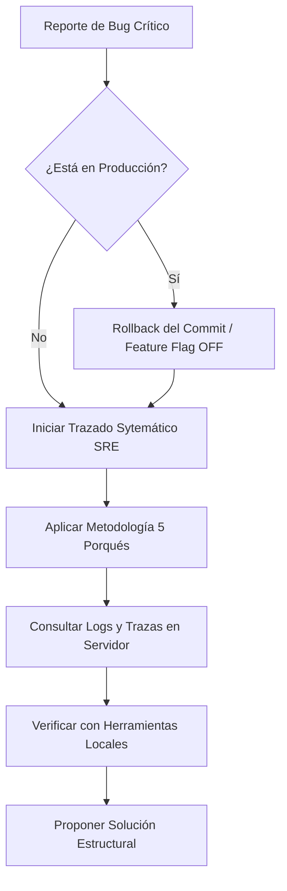

# Propuesta de Integración: Gestión y Resolución de Bugs bajo el Estándar NEXUS-PRO

Este documento presenta una propuesta detallada para preparar y equipar la Skill de **NEXUS-PRO (Neural Expert for Unified eXtended Systems)** en la detección, clasificación, diagnóstico y resolución sistemática de los siete tipos de bugs identificados en la arquitectura de software. 

La meta es alinear la taxonomía del reporte de errores con las directivas de arquitectura limpia (Clean Architecture), seguridad activa, aislamiento de inquilinos (tenant isolation) y observabilidad de NEXUS-PRO.

---

## 📊 Matriz de Alineación: Clasificación de Bugs vs. NEXUS-PRO

La siguiente tabla asocia las siete categorías de la imagen provista con las referencias técnicas, reglas de oro y patrones de resiliencia del estándar NEXUS-PRO:

| Categoría de Bug | Severidad | Impacto | Directiva / Patrón NEXUS-PRO Aplicable | Solución Arquitectónica Core |
| :--- | :--- | :--- | :--- | :--- |
| **1. Críticos (Blocker)** | MÁXIMA | Bloqueo total, caída del sistema, fallo al iniciar. | `evidence-based-debugging.md`<br>`diagnostics-rca.md` | Metodología de los 5 Porqués (5 Whys), reversión inmediata de commits, despliegue seguro con Feature Flags. |
| **2. Mayores** | ALTA | Fallo en función crítica (ej. pagos, importaciones), con workaround. | `idempotency.md`<br>`error-recovery.md` | Reintentos con respaldo exponencial (exponential backoff), Circuit Breaker en frontend, patrones de idempotencia. |
| **3. Menores** | MEDIA | Errores visuales leves, textos incorrectos, lógica no crítica rota. | `internationalization.md`<br>`design-system.md` | Centralización en archivos de traducción (i18n), tipado estricto de propiedades, desacoplamiento de textos crudos. |
| **4. Cosméticos / UI** | BAJA | Desalineación, inconsistencias visuales, fallos de diseño. | `design-system.md`<br>`frontend.md` | Uso riguroso de tokens de espaciado y tema, estructuras defensivas CSS (Flexbox/Grid), componentes UI validados. |
| **5. De Rendimiento** | MEDIA-ALTA | Carga lenta, alto consumo de RAM o CPU, degradación de UX. | `performance.md`<br>`database-indexing.md` | Limpieza en `useEffect` (React) para evitar fugas de memoria, optimización anti-N+1, indexación DB, lotes de 200 items. |
| **6. De Seguridad** | MÁXIMA | Vulnerabilidades, SQL Injection, acceso no autorizado (IDOR). | `tenant-isolation.md`<br>`security.md` | Validación estricta de propiedad de datos, obtención de `companyId` desde el token (no del cliente), sanitización y rate limit. |
| **7. De Compatibilidad** | BAJA-MEDIA | Fallos específicos en ciertos navegadores (Safari), SO o resoluciones. | `capacitor-pwa-advanced.md`<br>`mobile-pwa.md` | Estándar PWA sin APIs experimentales no soportadas, polifills estructurados, testing automatizado multi-navegador. |

---

## 🛠️ Plan de Acción por Categoría de Bug

A continuación se detalla la propuesta técnica para cada tipo de error, incluyendo su prevención en desarrollo y su protocolo de resolución cuando ocurren en producción.

### 1. Bugs Críticos (Blockers)
Impedimento total del funcionamiento del software (ej. bucle de redirección en login, pantalla en blanco al iniciar).

* **Prevención en NEXUS-PRO:**
  * Implementación de **Smoke Tests** y pruebas de integración automatizadas en el pipeline de CI/CD que validen la inicialización de la app y del enrutador.
  * Uso de compuertas de despliegue basadas en Feature Flags para desactivar módulos nuevos instantáneamente en caso de fallo crítico en producción.
* **Resolución y Diagnóstico (Metodología RCA):**
  * **Paso 1: Contención.** Si el fallo está en producción, no se escribe código apresurado. Se ejecuta rollback del commit o se desactiva la Feature Flag responsable.
  * **Paso 2: Aplicación de los 5 Porqués.** Trazar la ejecución sistemáticamente partiendo desde el punto de fallo (ej. consola del navegador o log del servidor).
  * **Paso 3: Verificación empírica.** Uso de herramientas de lectura y búsqueda en el servidor de logs para aislar la excepción antes de proponer cualquier cambio.



---

### 2. Bugs Mayores
Fallas que bloquean flujos de negocio esenciales (como facturación o cobros) pero permiten al usuario utilizar otras secciones de la plataforma.

* **Prevención en NEXUS-PRO:**
  * Todo endpoint de pago o acción destructiva debe contar con cabecera de **Idempotencia** (`X-Idempotency-Key`) en el middleware para evitar dobles cobros o duplicidad de transacciones.
  * Implementación del patrón **Circuit Breaker** en el cliente React: si el microservicio de pagos falla 5 veces consecutivas, el frontend bloquea las peticiones temporales durante 60 segundos y ofrece métodos alternativos.
* **Resolución y Diagnóstico:**
  * Triangulación obligatoria: frontend payload $\rightarrow$ FormRequest backend $\rightarrow$ estructura de persistencia en PostgreSQL.
  * Evaluar si el fallo se debe a un error de sincronización de estado (ej. conexión inestable offline/online en terminal de punto de venta).

> [!IMPORTANT]
> Los mecanismos de recuperación de fallos nunca deben reintentar peticiones de manera inmediata. Se debe utilizar respaldo exponencial (exponential backoff) con intervalos ordenados (ej. 1s, 2s, 4s).

---

### 3. Bugs Menores
Fallos funcionales de baja prioridad que no impiden el uso de la aplicación, como mensajes mal traducidos o inconsistencias en textos de alerta.

* **Prevención en NEXUS-PRO:**
  * Prohibición absoluta de textos "hardcoded" (crudos) en los componentes visuales. Todos los strings de la UI deben consumirse desde diccionarios estructurados i18n (`/locales/{es,en}.json`).
  * Validación estricta de esquemas de traducción mediante linters para asegurar que no falten claves en diferentes idiomas.
* **Resolución y Diagnóstico:**
  * Corrección centralizada en el archivo JSON de idioma correspondiente, evitando tocar archivos JSX/TSX de componentes, reduciendo así la probabilidad de introducir errores colaterales de renderizado.

---

### 4. Bugs Cosméticos o de UI
Problemas de alineación, fuentes incorrectas, desbordamiento de componentes en pantallas pequeñas o iconos rotos.

* **Prevención en NEXUS-PRO:**
  * Adherirse rigurosamente al sistema de diseño definido (`design-system.md`). Solo se permite el uso de variables de tema preestablecidas para espaciados, colores y bordes.
  * Uso de layouts fluidos y defensivos (flexbox y CSS grid con límites `min-width` y `max-width`) para evitar colapsos visuales.
* **Resolución y Diagnóstico:**
  * Verificación en resoluciones comunes (móvil, tablet, escritorio) antes de dar por completado el ticket.
  * Auditoría de accesibilidad básica (contraste y legibilidad) al corregir elementos visuales.

---

### 5. Bugs de Rendimiento
Tiempos de carga prolongados, consumo desmedido de memoria RAM en el navegador o bloqueos debido a consultas lentas en base de datos.

* **Prevención en NEXUS-PRO:**
  * **Reglas Frontend:** Todo efecto secundario (`useEffect`) debe retornar una función de limpieza (cleanup) para evitar fugas de memoria al desmontar componentes. Límite estricto de máximo 2 efectos por archivo visual.
  * **Reglas Backend:** Prohibición estricta de consultas que provoquen N+1. Uso obligatorio de carga ansiosa (eager loading) y selección explícita de columnas en lugar de `SELECT *`.
  * **Persistencia:** Toda consulta de búsqueda de texto o filtrado por clave foránea debe contar con un índice explícito en la base de datos a través de migraciones estructuradas (`$table->index()`).
* **Resolución y Diagnóstico:**
  * Análisis de consultas SQL mediante herramientas de profiling.
  * Revisión del tamaño de los payloads de respuesta: los datos masivos deben transferirse paginados o procesarse en lotes de tamaño controlado (máximo 200 registros por lote).

---

### 6. Bugs de Seguridad
Fugas de información, inyecciones de código, accesos no autorizados por falta de validación de permisos (IDOR) o exposición de secretos.

* **Prevención en NEXUS-PRO:**
  * **Aislamiento Multi-inquilino (Multi-tenant):** El identificador del cliente (`companyId` o `tenantId`) NUNCA se recibe en el payload del cliente o parámetros de URL en endpoints modificadores. Se extrae directamente del token de autenticación (ej. Laravel Sanctum o JWT) validado en el servidor.
  * **Validación de Propiedad:** Antes de procesar cualquier recurso, el backend debe validar que el registro pertenece al inquilino autenticado mediante políticas de acceso (Policies).
  * **Sanitización de logs:** Queda prohibido imprimir contraseñas, tokens de autenticación o datos financieros en los registros del sistema.
  * **Protección activa:** Rate limiting configurado obligatoriamente en todas las rutas de API públicas para mitigar ataques de denegación de servicio (DDoS).
* **Resolución y Diagnóstico:**
  * Análisis estático de código mediante herramientas SAST en el pipeline.
  * Corrección inmediata a nivel de middleware o política de acceso para cerrar la brecha sin modificar lógica de negocio.

> [!WARNING]
> Cualquier bug catalogado en esta sección requiere atención inmediata en producción y la generación automática de un Registro de Decisión Arquitectónica (ADR) para documentar el parche de seguridad aplicado.

---

## 📝 "Reportar bien es el primer paso para arreglar bien"

Siguiendo la premisa del pie de página de la imagen del usuario, se propone el siguiente estándar para el reporte de bugs. Un reporte estructurado permite a la Skill NEXUS-PRO operar con máxima precisión y velocidad sin necesidad de realizar asunciones incorrectas:

### Plantilla de Reporte de Bug Estándar (NEXUS-PRO)

Cuando detectes un error, provéelo en el siguiente formato para acelerar la resolución sistemática:

```markdown
### 1. Clasificación del Bug
- **Categoría:** [Crítico / Mayor / Menor / Cosmético / Rendimiento / Seguridad / Compatibilidad]
- **Severidad:** [Máxima / Alta / Media / Baja]

### 2. Evidencia Técnica
- **Mensaje de Error Crudo:** [Excepción del backend o consola del navegador]
- **Request ID:** [ req_xxxx (si está disponible en los encabezados) ]
- **Entorno:** [Producción / Staging / Local]
- **Navegador/SO:** [Chrome 125, Safari iOS 17, etc.]

### 3. Contexto de Ejecución
- **Punto de Entrada:** [Ruta de API (ej: POST /api/v1/payments) o Componente Frontend (ej: CheckoutForm.tsx)]
- **Payload Enviado:**
  ```json
  {
    "amount": 1500,
    "method": "card"
  }
  ```
- **Código Relacionado:** [Adjuntar código del Controller, Service o Hook involucrado]
```

---

## 📈 Conclusiones e Integración en NEXUS-PRO

Para que la Skill NEXUS-PRO responda automáticamente a esta taxonomía de bugs, se propone la integración de estas reglas directamente en el núcleo del sistema a través de dos mecanismos:

1. **Actualización de la Guía de Depuración (`evidence-based-debugging.md`):** Integrar este mapeo de siete niveles para que la IA clasifique automáticamente cada error que reciba del usuario antes de sugerir un plan de acción.
2. **Generación Automatizada de Diagnósticos:** Cuando se solicite reparar un bug, la IA estructurará su respuesta bajo la taxonomía de la imagen, entregando la causa raíz basada en los 5 Porqués y los pasos de mitigación correspondientes.

> [!TIP]
> Puedes utilizar el comando `/grill-me` para definir detalles específicos de tu infraestructura (como gestores de logs o herramientas de monitoreo) y adaptar esta propuesta exactamente a las necesidades de tu proyecto actual.
